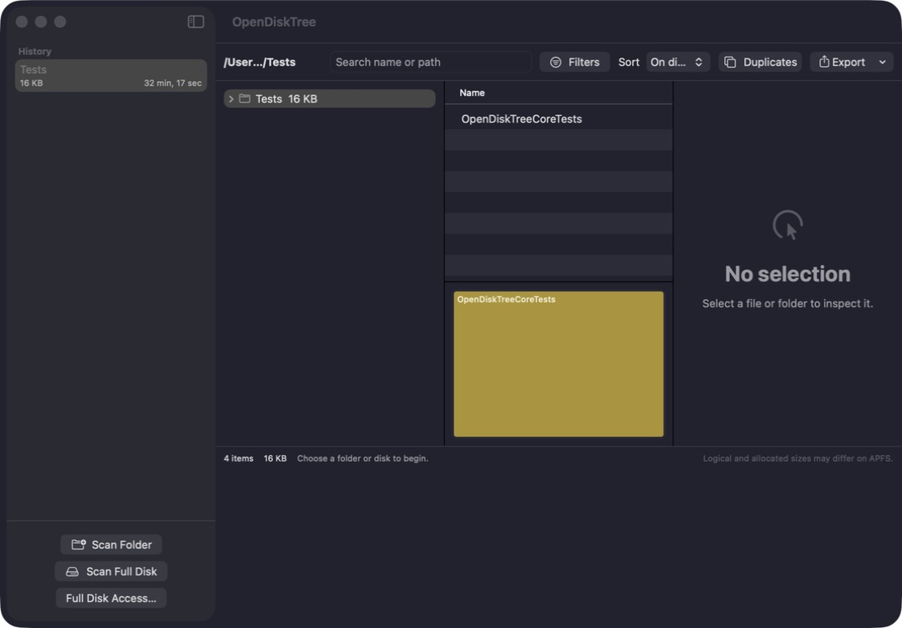

# OpenDiskTree

OpenDiskTree is a native disk-space explorer for Apple Silicon Macs. It answers two questions without sending a directory listing anywhere: what is using the disk, and which items deserve a closer look before cleanup?

The app combines a directory outline, sortable file table and treemap. Known data receives an explainable safety label; everything else remains **Review**. Complete scans can be exported as JSON, CSV or SQLite, while the smaller AI report keeps only useful summaries and can pseudonymize private path segments.

[](https://github.com/NikkyWay/OpenDiskTree/releases/latest/download/OpenDiskTree-arm64.dmg)

[View all releases](https://github.com/NikkyWay/OpenDiskTree/releases) · Apple Silicon · macOS 14+



## Highlights

- Fast metadata traversal with macOS `getattrlistbulk`, a continuous bounded worker pool and a POSIX fallback for other local filesystems.
- A quick overview appears while the exact scan runs: depth-limited folder totals are available first and are clearly marked as estimates until the exact snapshot replaces them.
- Logical and allocated sizes, with hard-linked blocks counted once in totals.
- Search plus filters for extension, status, size, modification date and duplicates.
- Five safety states: safe to delete, recreated automatically, delete through the source application, do not touch and review.
- Finder reveal from the inspector, table context menu or `⌘R`.
- Recoverable cleanup through the macOS Trash. There is no permanent-delete path.
- On-demand duplicate detection using size, sample hashes and full SHA-256 verification.
- The two latest successful snapshots per root, including added, removed and grown files.
- Complete JSON, CSV and SQLite exports for the full scan, current filter or selected subtree.
- Large exports stream with keyset pagination; SQLite output is a relational snapshot with foreign keys and indexes.
- A `Largest files` view jumps directly to the biggest files in the current snapshot.
- Fast repeat scans reuse unchanged directory subtrees from the local index. The toolbar also has **Full rescan from scratch** when you need a fresh traversal.
- The folder outline expands lazily: opening a deep directory reads only that branch, so a huge historical snapshot does not need to decode its entire tree at launch.
- Compact AI reports with configurable limits and full, basic or strict path privacy.
- English and Russian interface, local custom rules and no telemetry.

## Requirements

- Apple Silicon Mac
- macOS 14 or newer
- Xcode 16 or newer when building from source

## Build from source

Open the package in Xcode, or build entirely from the terminal:

```sh
swift build
swift test
./Scripts/build-app.sh
open dist/OpenDiskTree.app
```

`build-app.sh` creates an ad-hoc signed application. Release ZIP, DMG and SHA-256 manifest are built with:

```sh
./Scripts/release.sh 1.0.3
```

The command creates `OpenDiskTree-arm64.dmg`, `OpenDiskTree-arm64.zip` and `SHA256SUMS.txt`. GitHub release artifacts are unsigned. On first launch, macOS may require **Control-click → Open**. Developer ID signing and notarization can be added later without changing the application targets.

## First scan

Use **Scan Folder** for a normal directory or external local disk. **Scan Full Disk** starts at `/` and avoids mounted external, network and APFS backing volumes so the same data is not counted twice.

macOS protects Mail, Messages, browser data and several other directories. To include them, open **Full Disk Access…**, enable OpenDiskTree in System Settings, quit the app and launch it again. The scanner never installs a privileged helper; paths that remain inaccessible are counted and exported as scan errors.

When you choose a folder through **Scan Folder**, OpenDiskTree stores a macOS security-scoped bookmark for that folder and reuses it on the next launch. The first access still requires the normal macOS confirmation. Scanning the entire `/` volume is governed by the separate Full Disk Access setting; rebuilding an ad-hoc local copy can make macOS treat it as a new app identity and ask again.

Balanced mode limits I/O pressure. Turbo mode uses larger batches and more parallel directory reads. Both modes keep a bounded pool continuously occupied instead of waiting for the slowest directory in a batch. Metadata batches are written through an ordered SQLite pipeline with backpressure, so traversal and persistence overlap without retaining an unbounded number of files in memory. Folder totals and safety labels are accumulated once, bottom-up, while the scan is still hot; finalization updates each directory exactly once instead of rescanning the item table for every path depth. A full-disk scan stops at nested mounted volumes such as Simulator runtimes instead of walking the same operating-system data again. A cancelled scan stays marked partial and never replaces a successful comparison snapshot.

After a successful full scan, OpenDiskTree keeps a local metadata index and listens to the public macOS FSEvents journal. A **Fast update current scan** re-enumerates changed branches and copies unchanged subtrees directly inside SQLite, preserving stable item IDs and totals. This is deliberately conservative: after a restart, dropped FSEvents, an incomplete snapshot or changes during the scan, the fast option is disabled and the app falls back to a full scan. There is no private APFS parser or undocumented filesystem access, so the app remains compatible with FileVault, APFS volume groups and future macOS updates.

The app starts a separate quick overview while the exact scan is preparing. It lists the selected directory immediately using the same native bulk metadata request, shows sizes for entries that are files, labels folder totals as partial estimates, and never writes those provisional rows into the exact SQLite snapshot. The exact scan then enumerates every visible filesystem object and replaces the overview with real files, statuses and metadata. macOS does not expose a public Windows-MFT equivalent, so timings still depend on the number of directories, permissions, cache state and SSD. On the development Mac, the reproducible full `/` benchmark traversed 1.96 million visible items in 19.8 seconds and produced a clean finalized SQLite snapshot in 27.3 seconds. Those are local measurements, not a guarantee for every volume.

While a scan is running, the status bar shows elapsed time, processing rate and the current path. Folder totals and the treemap settle after the final aggregation pass; until then the interface labels them as calculating rather than displaying a misleading zero.

## Understanding the labels

- **Safe to delete** is reserved for disposable data such as diagnostic logs, with a reason visible in the inspector.
- **Recreated automatically** covers caches and build products that may cost time or network traffic to rebuild.
- **Delete through application** marks managed data such as Docker storage, Simulator devices and Xcode archives.
- **Do not touch** covers protected system locations.
- **Review** means OpenDiskTree does not have enough evidence. It is not a hidden recommendation to delete.

Folders are classified conservatively. A protected child cannot be hidden by a safer parent label. Strict cleanup mode blocks application-managed and protected data, while review and mixed folders require an explicit risk confirmation. Advanced settings can relax this, but every action still goes through the Trash and validates that the file identity has not changed since the scan.

Built-in rules and their sources are described in [Docs/Rules.md](Docs/Rules.md). Custom rules can be previewed against the current view and transferred as versioned JSON.

## Exports and privacy

The complete formats share schema version 1:

- JSON is convenient for scripts and smaller scans.
- CSV is a flat UTF-8 table for spreadsheets.
- SQLite is the practical choice for millions of rows.
- `ai-report.json` contains top files and folders, status/extension totals, inaccessible paths, duplicate groups and snapshot changes.

Full paths preserve everything. Basic privacy replaces the home and volume identity. Strict privacy keeps useful system names and extensions while replacing personal path segments with stable tokens for that export. Strict exports also omit content hashes. File contents are never exported.

See [Docs/ExportFormat.md](Docs/ExportFormat.md) for the stable fields. Automated labels and AI suggestions are context, not a backup strategy or a guarantee that deletion is harmless.

## Size accounting

Logical size is the length applications see. Allocated size comes from filesystem blocks and is closer to immediately occupied storage. Sparse files, compression and hard links can make the numbers differ substantially.

Hard links are identified by volume and file ID and counted once in aggregate allocated totals. APFS clones can share physical blocks, but macOS does not expose enough public information to calculate their unique contribution exactly. OpenDiskTree states this limitation instead of presenting a false exact result.

## Development

The Swift package contains three layers:

- `OpenDiskTreeNative` performs batch directory reads.
- `OpenDiskTreeCore` owns scanning, SQLite, rules, duplicate detection and exports.
- `OpenDiskTreeApp` contains the SwiftUI shell and virtualized AppKit outline/table views.

`swift test` covers real temporary directory scans, Unicode paths, packages, symlinks, history, protected aggregation, privacy, exports and duplicate hashing. CI exercises reduced scanner and persistence benchmarks. Before a release, run the synthetic two-million-row writer profile with `./Scripts/benchmark.sh 2000000`. Use `./Scripts/benchmark-real.sh / balanced` for a read-only full-filesystem traversal plus a temporary SQLite snapshot; the script removes its temporary database when the test finishes. Large-disk timings still depend on filesystem state, permissions and SSD performance.

Contributions are welcome; read [CONTRIBUTING.md](CONTRIBUTING.md) first. Security and privacy reports belong in [SECURITY.md](SECURITY.md).

## License

MIT. Copyright (c) 2026 NikkyWay.
